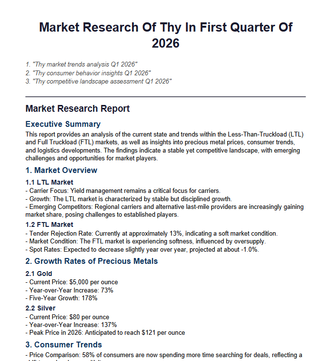

# Market Research Agent

## Example Output

## Purpose

An AI-powered agent that autonomously conducts market research on a given topic. It searches the web, analyzes the collected data, writes a structured report, and exports it as a PDF.

## Workflow

1. **Lead Researcher** — Breaks the topic into 3 targeted sub-queries and searches the web using Tavily.
2. **Data Analyst** — Extracts key metrics (market share, growth rates, trends) from the raw results and structures them as JSON.
3. **Report Writer** — Generates a Markdown-formatted market research report from the structured data.
4. **Grader** — Scores the report (0–100). If the score is below 50 and fewer than 3 revisions have been made, the agent loops back to the Lead Researcher for another round of research.
5. **PDF Export** (`create_pdf.py`) — Converts the final report into a formatted PDF file named after the research topic.

